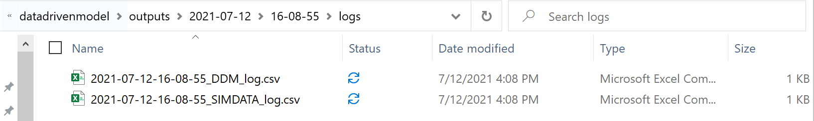

# Training Data-Driven or Surrogate Simulators

This repository provides a template for training data-driven simulators that can then be leveraged for training brains (reinforcement learning agents) with [Project Bonsai](https://docs.bons.ai/).

:warning: Disclaimer: This is not an official Microsoft product. This application is considered an experimental addition to Microsoft's Project Bonsai toolbox. Its primary goal is to reduce barriers of entry to use Project Bonsai's core Machine Teaching. Pull requests for fixes and small enhancements are welcome, but we expect this to be replaced by out-of-the-box features of Project Bonsai shortly.

## Dependencies

This repository leverages [Anaconda](https://docs.conda.io/en/latest/miniconda.html) for Python virtual environments and all dependencies. Please install Anaconda or miniconda first and then run the following:

```bash
conda env update -f environment.yml
conda activate ddm
```

This will create and activate a new conda virtual environment named `ddm` based on the configuration in the [`environment.yml`](environment.yml) file.

## Tests

To get an understanding of the package, you may want to look at the tests in [`tests`](./tests), and the configuration files in [`conf`](./conf). You can run the tests by simply:

```bash
pytest tests
# or
python -m pytest tests/
```

## Usage

The scripts in this package expect that you have a dataset of CSVs or numpy arrays. If you are using a CSV, you should ensure that:

- The CSV has a header with unique column names describing your inputs to the model and the outputs of the model.
- The CSV should have a column for the episode index and another column for the iteration index.
- The CSV should have been cleaned from any rows containing NaNs

### Generating Logs from an Existing Simulator

For an example on how to generate logged datasets from a simulator using the Python SDK, take a look at the examples in the [samples repository](https://github.com/microsoft/microsoft-bonsai-api/tree/main/Python/samples), in particular, you can use the flag `--test-local True --log-iteration True` to generate a CSV data that matches the schema used in this repository.

### Training Your Models

The scripts in this package leverage the configuration files saved in the [`conf`](./conf) folder to load CSV files, train and save models, and interface them to the Bonsai service. There are three configuration files:
- conf/data/$YOUR_DATA_CONFIG.yaml defines the interface to the data to train on
- conf/model/$YOUR_MODEL_CONFIG.yaml defines the Machine Learning model's hyper-parameters
- conf/simulator/$YOUR_SIM_CONFIG.yaml defines the simulator interface

The library comes with a default configuration set in [`conf/config.yaml`](conf/config.yaml).

```bash
python ddm_trainer.py
```

You can change any configuration parameter by specifying the configuration file you would like to change and its new path, i.e.,

```bash
python ddm_trainer.py data=cartpole_st_at simulator=gboost_cartpole
```

which will use the configuration files in [`conf/data/cartpole_st_at.yaml`](./conf/data/cartpole_st_at.yaml) and [`conf/simulator/gboost_cartpole.yaml`](./conf/simulator/gboost_cartpole.yaml).

You can also override the parameters of the configuration file by specifying their name:

```bash
python ddm_trainer.py data.path=csv_data/cartpole_at_st.csv data.iteration_order=1
python ddm_trainer.py data.path=csv_data/cartpole_at_st.csv model=xgboost 
```

The script automatically saves your model to the path specified by `model.saver.filename`. An `outputs` directory is also saved with your configuration file and logs.

#### Episode Initialization and Scenario Parameters

In order to specify episode initializations and scenario parameters, you can provide a dictionary of parameters to the `simulator` yaml file:

```yaml
simulator:
  states:
    ["cart_position", "cart_velocity", "pole_angle", "pole_angular_velocity"]
  actions: ["command"]
  configs: ["pole_length", "pole_mass", "cart_mass"]
  # estimate these during training
  # e.g.,:
  episode_inits: { "pole_length": 0.4, "pole_mass": 0.055, "cart_mass": 0.31 }
  # e.g.,:  your simulator may need to know the initial state
  # before the first episode. define these here as a dictionary
  # you can include these in your Inkling scenarios during brain training
  initial_states:
    {
      "cart_position": 0,
      "cart_velocity": 0,
      "pole_angle": 0,
      "pole_angular_velocity": 0,
    }
  # episode_inits:
  policy: bonsai
  logging: enable
  workspace_setup: True
```

When training with a brain, make sure that your scenario definitions include both `initial_state` values and/or `episode_inits` values.

### Hyperparameter Tuning

You can also do some hyperparameter tuning by setting `sweep.run` to True in your `conf.model.yaml` file and specifying the parameters to sweep over and their distributions in the params argument:

```yaml
sweep:
  run: True
  search_algorithm: random
  num_trials: 3
  scoring_func: r2
  params:
    estimator__max_depth: [1, 3, 5, 10]
    estimator__gamma: [0, 0.5, 1, 5]
    estimator__subsample: [0.1, 0.5, 1]
```

The sweeping function uses [`tune-sklearn`](https://github.com/ray-project/tune-sklearn/). Valid choices for `search_algorithm` are: bayesian, random, bohb, and hyperopt.

### Building Your Simulators

The schema for your simulator resides in [`conf/simulator`](./conf/simulator). After defining your states, actions, and configs, you can run the simulator as follows:

```bash
python ddm_predictor.py simulator=$YOUR_SIM_CONFIG
```

> NOTE: If wanting to train with bonsai, make sure `conf/simulator/policy` is set to "bonsai" instead of "random"

If you would like to test your simulator before connecting to the platform, you can use a random policy:

```bash
python ddm_predictor.py simulator=$YOUR_SIM_CONFIG simulator.policy=random
```

> NOTE: The optional flags should NOT have .yml; it should just be the name of the config file

If you're having trouble running locally, chances are you need to set up your workspace and access key configs. You can do this by using environment variables or the following command

```bash
python ddm_predictor.py simulator.workspace_setup=True
```

## Signal Builder

Sometimes there are variables that need to be provided from the simulator for brain training, but we don't necessarily want a ddm model to predict it. A `SignalBuilder` class in `signal_builder.py` can be used to create signals with different types such as `step_function`, `ramp`, and `sinewave`. You can configure signals in the `conf/simulator` file by adding a key and a the desired signal type. The horizon is the length of episode. The signal will be created and the current signal will be provided as it is indexed through an episode in `ddm_predictor.py`.

Depending on the signal type, you'll need to provide different signal parameters. One can randomize the signals at the start of every episode by specifying the min/max. If you want them to be constant, just set them to be the same. 

### Step Function

- start
- stop
- transition

### Ramp

- start
- stop

### Sine Wave

- amplitude
- mean

### Constant

- value

### Piecewise

- conditions (must use list)
- values (must use list)

```yml
  signal_builder:
    signal_types: 
      Tset: step_function
      Tout: sinewave
    horizon: 288
    signal_params:
      Tset: 
        conditions:
          min: [0, 110, 205]
          max: [0, 110, 205]
        values:
          min: [25, 22, 24]
          max: [25, 22, 24]
      Tout:
        amplitude:
          min: 5
          max: 5
        median:
          min: 25
          max: 25
        median: 25
```

## Generate Logs for Comparing DDM and Original Sim

Validating your ddm simulator against the original sim is heavily recommended, especially paying attention to error propagation in a sequential manner. `ddm_test_validate.py` is one way to generate two csv files in `outputs/<DATE>/<TIME>/logs`. 

> NOTE: ddm_test_validate.py does NOT currently generate plots for generic models



In order to use `ddm_test_validate.py`, a few steps will need to be followed:

1. Place the original simulator's `main.py` at the same root level where `ddm_test_validate.py` is. Add simulator files into `sim/<FOLDER>/sim/`.

```bash
├───ddm_test_validate.py
├───main.py
├───sim
│   ├───quanser
│   │   ├───sim
│   │   |   ├───qube_simulator.py
```

2. Modify imports so main.py can successfully run simulator in new location

```python
from sim.quanser.sim.qube_simulator import QubeSimulator
from sim.quanser.policies import random_policy, brain_policy
```

3. Ensure the config in `conf/simulator` does NOT have the default policy as bonsai. You'll want to use "random" or create your own expert policy.

> NOTE: You can override your policy from the CLI, will be shown in the final step

4. Provide a scenario config in `ddm_test_validate.py` to ensure you start with initial configurations that are better than just random.

```python
        '''
       TODO: Add episode_start(config) so sim works properly and not initializing
        with unrealistic initial conditions.
        '''
        sim.episode_start()
        ddm_state = sim.get_state()
        sim_state = sim.get_sim_state()
```

5. Run `ddm_test_validate.py`

```python
python ddm_test_validate.py simulator.policy=random
```

## Build Simulator Package

```bash
az acr build --image <IMAGE_NAME>:<IMAGE_VERSION> --file Dockerfile --registry <ACR_REGISTRY> .
```

## Contribute Code
This project welcomes contributions and suggestions. Most contributions require you to
agree to a Contributor License Agreement (CLA) declaring that you have the right to,
and actually do, grant us the rights to use your contribution. For details, visit
https://cla.microsoft.com.

When you submit a pull request, a CLA-bot will automatically determine whether you need
to provide a CLA and decorate the PR appropriately (e.g., label, comment). Simply follow the
instructions provided by the bot. You will only need to do this once across all repositories using our CLA.

This project has adopted the [Microsoft Open Source Code of Conduct](https://opensource.microsoft.com/codeofconduct/).
For more information see the [Code of Conduct FAQ](https://opensource.microsoft.com/codeofconduct/faq/)
or contact [opencode@microsoft.com](mailto:opencode@microsoft.com) with any additional questions or comments.

## Telemetry
The software may collect information about you and your use of the software and send it to Microsoft. Microsoft may use this information to provide services and improve our products and services. You may turn off the telemetry as described in the repository. There are also some features in the software that may enable you and Microsoft to collect data from users of your applications. If you use these features, you must comply with applicable law, including providing appropriate notices to users of your applications together with a copy of Microsoft's privacy statement. Our privacy statement is located at https://go.microsoft.com/fwlink/?LinkID=824704. You can learn more about data collection and use in the help documentation and our privacy statement. Your use of the software operates as your consent to these practices.

## Trademarks
This project may contain trademarks or logos for projects, products, or services. Authorized use of Microsoft trademarks or logos is subject to and must follow Microsoft's Trademark & Brand Guidelines. Use of Microsoft trademarks or logos in modified versions of this project must not cause confusion or imply Microsoft sponsorship. Any use of third-party trademarks or logos are subject to those third-party's policies.
