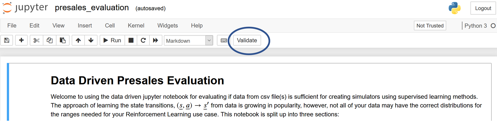

# Training Data-Driven or Surrogate Simulators

This repository provides a template for training data-driven simulators that can then be leveraged for training brains (reinforcement learning agents) with [Project Bonsai](https://docs.bons.ai/).

:warning: Disclaimer: This is not an official Microsoft product. This application is considered an experimental addition to Microsoft's Project Bonsai toolbox. Its primary goal is to reduce barriers of entry to use Project Bonsai's core Machine Teaching. Pull requests for fixes and small enhancements are welcome, but we expect this to be replaced by out-of-the-box features of Project Bonsai shortly.

## Dependencies

This repository leverages [Anaconda](https://docs.conda.io/en/latest/miniconda.html) for Python virtual environments and all dependencies. Please install Anaconda or miniconda first and then run the following:

```bash
conda env update -f environment.yml
conda activate ddm
```

## Tests

To get an understanding of the package, you may want to look at the tests in [`tests`](./tests), and the configuration files in [`conf`](./conf).

## Usage

The scripts in this package expect that you have a dataset of CSVs or numpy arrays. If you are using a CSV, you should ensure your CSV has a header with unique column names describing your inputs to the model and the outputs of the model. In addition, your CSV should have a column for the episode index and another column for the iteration index.

### Generating Logs from an Existing Simulator

For an example on how to generate logged datasets from a simulator using the Python SDK, take a look at the examples in the [samples repository](https://github.com/microsoft/microsoft-bonsai-api/tree/main/Python/samples), in particular, you can use the flag `--test-local True --log-iteration True` to generate a CSV data that matches the schema used in this repository.

### Training Your Models

The scripts in this package leverage the configuration files saved in the [`conf`](./conf) folder to load CSV files, train and save models, and interface them to the Bonsai service. The library comes with a default configuration set in [`conf/config.yaml`](conf/config.yaml).

```bash
python datamodeler2.py
```

You can change any configuration parameter by specifying the configuration file you would like to change and its new path, i.e.,

```bash
python datamodeler2.py data=cartpole_st_at
```

which will use the configuration file in [`conf/data/cartpole_st_at.yaml`](./conf/data/cartpole_st_at.yaml).


You can also override parameters of the configuration file by specifying their name:

```bash
python datamodeler2.py data.path=csv_data/cartpole_at_st.csv data.iteration_order=1
python datamodeler2.py data.path=csv_data/cartpole_at_st.csv model=xgboost 
```

The script automatically saves your model to the path specified by `model.saver.filename`. An `outputs` directory is also saved with your configuration file and logs.

## Build Simulator Package

```bash
az acr build --image <IMAGE_NAME>:<IMAGE_VERSION> --file Dockerfile --registry <ACR_REGISTRY> .
```

## Data Evaluation

Use the release version of the jupyter notebook to assist you with qualifying your data for creation of a simulator using supervised learning. The notebook is split up into three parts. The notebook uses the `nbgrader` package, where the user should click the `Validate` button to determine if all tests have been passed. You will be responsible for loading the data, running cells to see if you successfully pass tests, and manipulating the data in Python if the notebook finds things like NaNs and outliers. It will ask for desired operating limits of the model you wish to create and compare that against what is available in your provided datasets. Asssuming you pass the tests for data relevance, your data will be exported to a single csv named `approved_data.csv` which is ready to be ingested by the `datadrivenmodel` tool.

- Data Relevance
- Sparsity
- Data Distribution Confidence

```bash
jupyter notebook release/presales_evaluation/presales_evaluation.ipynb
```


> Once you have successfuly qualified your data using the `Validate` button, it is recommended to export it as a PDF to share the results without requiring access to the data.

## Contribute Code
This project welcomes contributions and suggestions. Most contributions require you to
agree to a Contributor License Agreement (CLA) declaring that you have the right to,
and actually do, grant us the rights to use your contribution. For details, visit
https://cla.microsoft.com.

When you submit a pull request, a CLA-bot will automatically determine whether you need
to provide a CLA and decorate the PR appropriately (e.g., label, comment). Simply follow the
instructions provided by the bot. You will only need to do this once across all repositories using our CLA.

This project has adopted the [Microsoft Open Source Code of Conduct](https://opensource.microsoft.com/codeofconduct/).
For more information see the [Code of Conduct FAQ](https://opensource.microsoft.com/codeofconduct/faq/)
or contact [opencode@microsoft.com](mailto:opencode@microsoft.com) with any additional questions or comments.

## Telemetry
The software may collect information about you and your use of the software and send it to Microsoft. Microsoft may use this information to provide services and improve our products and services. You may turn off the telemetry as described in the repository. There are also some features in the software that may enable you and Microsoft to collect data from users of your applications. If you use these features, you must comply with applicable law, including providing appropriate notices to users of your applications together with a copy of Microsoft's privacy statement. Our privacy statement is located at https://go.microsoft.com/fwlink/?LinkID=824704. You can learn more about data collection and use in the help documentation and our privacy statement. Your use of the software operates as your consent to these practices.

## Trademarks
This project may contain trademarks or logos for projects, products, or services. Authorized use of Microsoft trademarks or logos is subject to and must follow Microsoft's Trademark & Brand Guidelines. Use of Microsoft trademarks or logos in modified versions of this project must not cause confusion or imply Microsoft sponsorship. Any use of third-party trademarks or logos are subject to those third-party's policies.